# PocketLedger Codebase Analysis

> [!NOTE]
> This analysis covers both the **React Native Expo client** (`PocketLedger-client/`) and the **Express/PostgreSQL server** (`server/`), including migration schemas, architecture criticisms, and an API roadmap.

---

## 1. Architecture Overview

```mermaid
graph LR
    subgraph Client["PocketLedger-client (Expo Router)"]
        direction TB
        Auth["(auth)/login.tsx"]
        Home["(tabs)/index.tsx — Dashboard"]
        Logs["(tabs)/logs.tsx — Biyahe Logger"]
        Wallets["(tabs)/wallets.tsx — Budget Setup"]
        Settings["(tabs)/settings.tsx"]
        Components["components/ — CategoryCard, PillToggle, SettingRow, TransactionItem"]
        Theme["contexts/ThemeContext + hooks/useTheme + constants/theme"]
    end

    subgraph Server["server (Express + PostgreSQL)"]
        direction TB
        App["app.ts → /api/v1"]
        Routes["routes/index.ts (empty)"]
        Controllers["controllers/ (empty)"]
        Models["models/ (empty)"]
        Middlewares["middlewares/ (empty)"]
        Migrations["db/migrations/ — 001_init.sql, 002_seed_transit.sql"]
        DB["config/DB.ts — pg Pool"]
    end

    Client -- "future HTTP" --> Server
    Server --> PostgreSQL[(PostgreSQL 16)]
```



---

## 2. Codebase Criticisms

### 🔴 Critical Issues

| # | Issue | Where | Why it Matters |
|---|-------|-------|----------------|
| 1 | **100% hardcoded/mock data on the client** | [index.tsx](file:///Users/apple/Desktop/Dev%20Work/ReactNative/BudgetTracker/PocketLedger-client/src/app/%28tabs%29/index.tsx) (QUICK_ITEMS, RECENT_TRANSACTIONS), [logs.tsx](file:///Users/apple/Desktop/Dev%20Work/ReactNative/BudgetTracker/PocketLedger-client/src/app/%28tabs%29/logs.tsx) (LINES, LRT1_STATIONS, P2P_ROUTES), [wallets.tsx](file:///Users/apple/Desktop/Dev%20Work/ReactNative/BudgetTracker/PocketLedger-client/src/app/%28tabs%29/wallets.tsx) (CATEGORIES), [settings.tsx](file:///Users/apple/Desktop/Dev%20Work/ReactNative/BudgetTracker/PocketLedger-client/src/app/%28tabs%29/settings.tsx) (USER) | The app looks functional but is a static shell. Nothing persists, nothing is real. Tapping "Log Fare" or "Save Budget" does absolutely nothing. |
| 2 | **Server is an empty skeleton** | [routes/index.ts](file:///Users/apple/Desktop/Dev%20Work/ReactNative/BudgetTracker/server/src/routes/index.ts) is blank, `controllers/`, `models/`, `middlewares/` are empty directories | Docker + PostgreSQL + migrations all work, but there is literally zero API surface to consume. |
| 3 | **No auth whatsoever** | [login.tsx](file:///Users/apple/Desktop/Dev%20Work/ReactNative/BudgetTracker/PocketLedger-client/src/app/%28auth%29/login.tsx) calls `router.replace("/(tabs)")` on validation pass | No JWT, no session, no token storage. The login screen is purely cosmetic. |
| 4 | **CORS not configured** | [app.ts](file:///Users/apple/Desktop/Dev%20Work/ReactNative/BudgetTracker/server/src/app.ts) — `cors` is installed but never `app.use(cors(...))` | The RN client won't be able to call the server (especially on web/emulator via `localhost`). |
| 5 | **No API service layer on client** | No `services/`, no `api/` folder, no Axios/fetch wrapper | When you do build APIs, you have no centralized place to make HTTP calls. |

### 🟡 Moderate Issues

| # | Issue | Where | Details |
|---|-------|-------|---------|
| 6 | **Dead [useTheme](file:///Users/apple/Desktop/Dev%20Work/ReactNative/BudgetTracker/PocketLedger-client/src/app/hooks/useTheme.ts#4-17) hook** | [hooks/useTheme.ts](file:///Users/apple/Desktop/Dev%20Work/ReactNative/BudgetTracker/PocketLedger-client/src/app/hooks/useTheme.ts) | Duplicates what [ThemeContext](file:///Users/apple/Desktop/Dev%20Work/ReactNative/BudgetTracker/PocketLedger-client/src/app/contexts/ThemeContext.tsx#64-67) already provides. Nothing imports it. Delete it. |
| 7 | **Fare calculation is a crude formula** | [logs.tsx](file:///Users/apple/Desktop/Dev%20Work/ReactNative/BudgetTracker/PocketLedger-client/src/app/%28tabs%29/logs.tsx) L131: `15 + stops * 2` | Your migration has a full `transit_fares` table with real fare matrices. The client ignores this entirely and uses a fake linear formula. |
| 8 | **Station data only covers LRT-1** | [logs.tsx](file:///Users/apple/Desktop/Dev%20Work/ReactNative/BudgetTracker/PocketLedger-client/src/app/%28tabs%29/logs.tsx) uses `LRT1_STATIONS` for all lines | Selecting MRT-3 or LRT-2 still shows LRT-1 stations. The station list doesn't switch when changing the line selector. |
| 9 | **No error boundaries or loading states** | All screens | When you wire up real API calls, there are no loading spinners, error fallbacks, or retry mechanisms. |
| 10 | **[wallets.tsx](file:///Users/apple/Desktop/Dev%20Work/ReactNative/BudgetTracker/PocketLedger-client/src/app/%28tabs%29/wallets.tsx) page is titled "Budget Setup"** | Tab name is "Wallets" but the page is a budget allocation form | Confusing UX. The DB schema has a `budgets` table, not a `wallets` table. Pick one metaphor. |
| 11 | **Login doesn't support dark mode** | [login.tsx](file:///Users/apple/Desktop/Dev%20Work/ReactNative/BudgetTracker/PocketLedger-client/src/app/%28auth%29/login.tsx) uses hardcoded light colors (`Colors.backgroundLight`, `Colors.white`) | Every other screen respects the theme, but login does not. |
| 12 | **No register screen** | [login.tsx](file:///Users/apple/Desktop/Dev%20Work/ReactNative/BudgetTracker/PocketLedger-client/src/app/%28auth%29/login.tsx) L190 links to `/(auth)/register` | This route doesn't exist — tapping "Create an account" will crash or show a 404. |

### 🟢 Minor / Style Issues

| # | Issue | Details |
|---|-------|---------|
| 13 | **`as any` type casts on icon names** | Every `MaterialIcons name={icon as any}` — Use a proper icon name type or union. |
| 14 | **Root [.gitignore](file:///Users/apple/Desktop/Dev%20Work/ReactNative/BudgetTracker/.gitignore) is too minimal** | Only ignores `node_modules` and [.env](file:///Users/apple/Desktop/Dev%20Work/ReactNative/BudgetTracker/server/.env). Missing: `.expo/`, `dist/`, `*.tgz`, [.DS_Store](file:///Users/apple/Desktop/Dev%20Work/ReactNative/BudgetTracker/.DS_Store), etc. |
| 15 | **No ESLint/Prettier config** | No linting setup for either client or server. |
| 16 | **[docker-compose.yml](file:///Users/apple/Desktop/Dev%20Work/ReactNative/BudgetTracker/docker-compose.yml) has no client service** | Only the server and PostgreSQL are containerized. |
| 17 | **[ThemeColors](file:///Users/apple/Desktop/Dev%20Work/ReactNative/BudgetTracker/PocketLedger-client/src/app/contexts/ThemeContext.tsx#7-16) type has `isDark` inside theme object AND exposed separately** | [useThemeContext()](file:///Users/apple/Desktop/Dev%20Work/ReactNative/BudgetTracker/PocketLedger-client/src/app/contexts/ThemeContext.tsx#64-67) returns `{ theme: { isDark, ... }, isDark }` — redundant. |

---

## 3. Migration Schema → Frontend Mapping

Your migrations define a **rich, well-designed** database. Here's exactly how each table maps (or **should** map) to your frontend screens:

### 001_init.sql Tables

| DB Table | Frontend Screen(s) | Current Status | What Needs to Happen |
|----------|-------------------|----------------|---------------------|
| `users` | Login, Settings (profile card) | ❌ Mock `USER` object in settings, no real auth | Wire login to `POST /auth/login`, store JWT, display real user data |
| `oauth_accounts` | Login ("Continue with Google") | ❌ Button exists, does nothing | Implement Google OAuth flow → `POST /auth/google` |
| `refresh_tokens` | Background (token refresh) | ❌ No token management | Store refresh token securely (SecureStore), auto-refresh on 401 |
| `categories` | Dashboard (Quick Add), Budget Setup (category cards) | ❌ Hardcoded `CATEGORIES` and `QUICK_ITEMS` | `GET /categories` → render dynamic list, `POST /categories` for "Add Category" |
| `category_quick_add` | Dashboard (Quick Add section) | ❌ Hardcoded `QUICK_ITEMS` | `GET /categories/quick-add` for pinned items, `POST` to add/reorder |
| `transactions` | Dashboard (Recent History), all Log actions | ❌ Hardcoded `RECENT_TRANSACTIONS`, log buttons do nothing | `POST /transactions` on every "Log" tap, `GET /transactions` for history |
| `budgets` | Wallets/Budget Setup (total budget, period) | ❌ Local state only, not persisted | `POST /budgets` on "Save Budget", `GET /budgets/current` to load |
| `budget_items` | Wallets/Budget Setup (per-category allocation) | ❌ Local state only | Included in budget creation payload as nested items |

### 002_seed_transit.sql Tables

| DB Table | Frontend Screen(s) | Current Status | What Needs to Happen |
|----------|-------------------|----------------|---------------------|
| `transit_lines` | Logs (line selector: LRT-1, LRT-2, etc.) | ❌ Hardcoded `LINES` array | `GET /transit/lines` → render dynamically |
| `transit_stations` | Logs (station pickers) | ❌ Hardcoded `LRT1_STATIONS`, only one line | `GET /transit/lines/:lineId/stations` → dynamic per-line station list |
| `transit_routes` | Logs (P2P Bus Routes section) | ❌ Hardcoded `P2P_ROUTES` | `GET /transit/routes?type=p2p_bus` → dynamic route list |
| `transit_fares` | Logs (estimated fare calculation) | ❌ Fake formula: `15 + stops * 2` | `GET /transit/fares?origin=X&dest=Y&medium=SJT` → real fare lookup |
| `fare_discounts` | Logs (50% discount toggle) | ❌ Hardcoded 50% | `GET /transit/discounts?type=student` → dynamic discount rate |
| `transaction_transport` | Logs (when logging a transit fare) | ❌ Not used | Include in `POST /transactions` payload when `source = 'transpo'` |

### Key Insight

> [!IMPORTANT]
> **Every piece of static data in your frontend has a corresponding database table already designed for it.** Your migration schema is directly and immediately applicable — it was clearly designed WITH these screens in mind. The gap is purely the API layer connecting them.

---

## 4. API Roadmap: Priority Order

Here's the order I'd recommend building the APIs, based on dependency chains and immediate user impact:

### Phase 1: 🔐 Auth (Build First — Everything Depends on It)

Every endpoint below needs `user_id` from a JWT. Build this first.

**Endpoints:**

```
POST   /api/v1/auth/register     → Create user + hash password
POST   /api/v1/auth/login        → Verify credentials → issue JWT + refresh token
POST   /api/v1/auth/refresh      → Rotate refresh token
POST   /api/v1/auth/logout       → Revoke refresh token
POST   /api/v1/auth/google       → OAuth callback (later)
GET    /api/v1/auth/me           → Return current user profile
```

**Kickstart snippet — Auth controller shape:**

```typescript
// server/src/controllers/authController.ts
import { Request, Response } from "express";
import bcrypt from "bcrypt";
import jwt from "jsonwebtoken";
import pool from "../config/DB";

export const register = async (req: Request, res: Response) => {
  const { email, password, full_name } = req.body;
  
  // 1. Check if user exists
  const existing = await pool.query("SELECT id FROM users WHERE email = $1", [email]);
  if (existing.rows.length > 0) return res.status(409).json({ error: "Email taken" });
  
  // 2. Hash password
  const hash = await bcrypt.hash(password, 12);
  
  // 3. Insert user
  const result = await pool.query(
    "INSERT INTO users (email, password_hash, full_name) VALUES ($1, $2, $3) RETURNING id, email, full_name",
    [email, hash, full_name]
  );
  
  // 4. Issue tokens
  const user = result.rows[0];
  const accessToken = jwt.sign({ sub: user.id }, process.env.JWT_SECRET!, { expiresIn: "15m" });
  // ... store refresh token in DB
  
  res.status(201).json({ user, accessToken });
};
```

**Middleware shape:**

```typescript
// server/src/middlewares/authMiddleware.ts
import { Request, Response, NextFunction } from "express";
import jwt from "jsonwebtoken";

export interface AuthRequest extends Request {
  userId?: string;
}

export const requireAuth = (req: AuthRequest, res: Response, next: NextFunction) => {
  const token = req.headers.authorization?.replace("Bearer ", "");
  if (!token) return res.status(401).json({ error: "No token" });
  
  try {
    const payload = jwt.verify(token, process.env.JWT_SECRET!) as { sub: string };
    req.userId = payload.sub;
    next();
  } catch {
    res.status(401).json({ error: "Invalid token" });
  }
};
```

**Dependencies to install:**
```bash
npm install bcrypt jsonwebtoken
npm install -D @types/bcrypt @types/jsonwebtoken
```

---

### Phase 2: 🚇 Transit (Read-Only — Easy Wins, Big Visual Impact)

These are all **read-only endpoints** serving seed data. No auth required for reads. This is the fastest way to make your Logs screen "come alive."

**Endpoints:**

```
GET    /api/v1/transit/lines                          → All active lines
GET    /api/v1/transit/lines/:lineId/stations          → Stations for a line (sorted)
GET    /api/v1/transit/routes?type=p2p_bus              → P2P routes
GET    /api/v1/transit/fares?line=X&origin=Y&dest=Z&medium=SJT  → Fare lookup
GET    /api/v1/transit/discounts?passenger_type=student → Active discount rate
```

**Kickstart snippet — Transit routes file:**

```typescript
// server/src/routes/transitRoutes.ts
import { Router } from "express";
import pool from "../config/DB";

const router = Router();

router.get("/lines", async (_req, res) => {
  const { rows } = await pool.query(
    "SELECT id, code, name, color FROM transit_lines WHERE is_active = TRUE ORDER BY code"
  );
  res.json(rows);
});

router.get("/lines/:lineId/stations", async (req, res) => {
  const { rows } = await pool.query(
    "SELECT id, name, sort_order FROM transit_stations WHERE line_id = $1 AND is_active = TRUE ORDER BY sort_order",
    [req.params.lineId]
  );
  res.json(rows);
});

router.get("/fares", async (req, res) => {
  const { line_id, origin_id, destination_id, medium } = req.query;
  const { rows } = await pool.query(
    `SELECT base_fare FROM transit_fares 
     WHERE line_id = $1 AND origin_station_id = $2 AND destination_station_id = $3 
       AND fare_medium = $4 
     ORDER BY effective_from DESC LIMIT 1`,
    [line_id, origin_id, destination_id, medium || "SJT"]
  );
  res.json(rows[0] || { base_fare: null });
});

export default router;
```

**Client-side usage pattern:**

```typescript
// PocketLedger-client/src/app/services/api.ts (create this)
const BASE_URL = "http://localhost:3000/api/v1"; // or your Docker host

export async function getTransitLines() {
  const res = await fetch(`${BASE_URL}/transit/lines`);
  return res.json();
}

export async function getStations(lineId: string) {
  const res = await fetch(`${BASE_URL}/transit/lines/${lineId}/stations`);
  return res.json();
}
```

---

### Phase 3: 💰 Transactions (Core Feature)

This is the heart of the app — recording expenses.

**Endpoints:**

```
POST   /api/v1/transactions                → Log a new transaction
GET    /api/v1/transactions                → List user's transactions (paginated)
GET    /api/v1/transactions/:id            → Single transaction detail
PUT    /api/v1/transactions/:id            → Edit a transaction
DELETE /api/v1/transactions/:id            → Delete a transaction
GET    /api/v1/transactions/summary        → Dashboard stats (today's total, balance, etc.)
```

**Kickstart snippet — Transaction creation:**

```typescript
// Shape of POST /api/v1/transactions body
interface CreateTransactionBody {
  type: "income" | "expense";
  amount: number;                // must be > 0
  category_id?: string;         // UUID
  occurred_at: string;          // ISO timestamp
  note?: string;
  source: "manual" | "quick_add" | "transpo";
  
  // Only if source === "transpo"
  transport?: {
    line_id?: string;
    route_id?: string;
    origin_station_id?: string;
    destination_station_id?: string;
  };
}

// In your controller:
// 1. INSERT INTO transactions (...) VALUES (...) RETURNING id
// 2. If transport data exists:
//    INSERT INTO transaction_transport (transaction_id, line_id, route_id, ...) VALUES (...)
// 3. Return the full transaction
```

---

### Phase 4: 📂 Categories (User Customization)

**Endpoints:**

```
GET    /api/v1/categories                → User's categories
POST   /api/v1/categories                → Create custom category
PUT    /api/v1/categories/:id            → Update category
DELETE /api/v1/categories/:id            → Soft-delete (set is_active = false)
GET    /api/v1/categories/quick-add      → User's pinned quick-add categories
POST   /api/v1/categories/quick-add      → Pin/unpin a category
PUT    /api/v1/categories/quick-add/order → Reorder pins
```

**Kickstart snippet:**

```typescript
// Seeding default categories for new users (call this after registration)
const DEFAULT_CATEGORIES = [
  { name: "Transport", icon_key: "directions-bus", color: "#197fe6" },
  { name: "Food", icon_key: "restaurant", color: "#ea580c" },
  { name: "Savings", icon_key: "savings", color: "#10b981" },
  { name: "Others", icon_key: "more-horiz", color: "#64748b" },
];

async function seedCategories(userId: string) {
  for (const cat of DEFAULT_CATEGORIES) {
    await pool.query(
      "INSERT INTO categories (user_id, name, icon_key, color) VALUES ($1, $2, $3, $4) ON CONFLICT DO NOTHING",
      [userId, cat.name, cat.icon_key, cat.color]
    );
  }
}
```

---

### Phase 5: 📊 Budgets (Last — Needs Categories + Transactions First)

**Endpoints:**

```
POST   /api/v1/budgets                   → Create/update budget for a period
GET    /api/v1/budgets/current            → Get active budget with items + spent amounts
GET    /api/v1/budgets/:id               → Get specific budget
GET    /api/v1/budgets/history            → Past budgets
```

**Kickstart snippet — Budget with spending:**

```sql
-- This is the query your GET /budgets/current would run:
SELECT 
  b.id, b.period_type, b.period_start, b.period_end, b.allowance_amount,
  bi.category_id,
  c.name AS category_name,
  c.icon_key,
  c.color,
  bi.amount AS budgeted,
  COALESCE(SUM(t.amount), 0) AS spent
FROM budgets b
JOIN budget_items bi ON bi.budget_id = b.id
JOIN categories c ON c.id = bi.category_id
LEFT JOIN transactions t ON t.user_id = b.user_id 
  AND t.category_id = bi.category_id
  AND t.type = 'expense'
  AND t.occurred_at BETWEEN b.period_start AND b.period_end + INTERVAL '1 day'
WHERE b.user_id = $1 
  AND CURRENT_DATE BETWEEN b.period_start AND b.period_end
GROUP BY b.id, bi.id, c.id
ORDER BY c.name;
```

---

## 5. Immediate Action Items (Checklist)

- [ ] **Delete** [hooks/useTheme.ts](file:///Users/apple/Desktop/Dev%20Work/ReactNative/BudgetTracker/PocketLedger-client/src/app/hooks/useTheme.ts) (dead code)
- [ ] **Add `cors` middleware** to [app.ts](file:///Users/apple/Desktop/Dev%20Work/ReactNative/BudgetTracker/server/src/app.ts): `app.use(cors({ origin: true, credentials: true }))`
- [ ] **Create** `services/api.ts` in the client for centralized fetch calls
- [ ] **Create** `server/src/middlewares/authMiddleware.ts`
- [ ] **Install** `bcrypt`, `jsonwebtoken` on server
- [ ] **Build Phase 1** (Auth) → test with Postman
- [ ] **Build Phase 2** (Transit reads) → wire up [logs.tsx](file:///Users/apple/Desktop/Dev%20Work/ReactNative/BudgetTracker/PocketLedger-client/src/app/%28tabs%29/logs.tsx) station pickers
- [ ] **Fix** [logs.tsx](file:///Users/apple/Desktop/Dev%20Work/ReactNative/BudgetTracker/PocketLedger-client/src/app/%28tabs%29/logs.tsx) to switch stations per selected line (not hardcoded LRT-1)
- [ ] **Build Phase 3** (Transactions) → make "Log Fare" and "Log" buttons functional
- [ ] **Rename** "Wallets" tab to "Budget" for consistency with the DB schema
- [ ] **Add dark mode support** to [login.tsx](file:///Users/apple/Desktop/Dev%20Work/ReactNative/BudgetTracker/PocketLedger-client/src/app/%28auth%29/login.tsx)
- [ ] **Create** [(auth)/register.tsx](file:///Users/apple/Desktop/Dev%20Work/ReactNative/BudgetTracker/PocketLedger-client/src/app/components/PillToggle.tsx#11-15) (the route is referenced but doesn't exist)
- [ ] **Update** root [.gitignore](file:///Users/apple/Desktop/Dev%20Work/ReactNative/BudgetTracker/.gitignore) to include `.expo/`, `dist/`, [.DS_Store](file:///Users/apple/Desktop/Dev%20Work/ReactNative/BudgetTracker/.DS_Store)

---

## 6. Summary Verdict

| Aspect | Rating | Notes |
|--------|--------|-------|
| **DB Schema Design** | ⭐⭐⭐⭐⭐ | Excellent. Well-normalized, proper constraints, good indexing, transit fare structure is thoughtful |
| **Frontend UI/UX** | ⭐⭐⭐⭐ | Good looking, proper theming, nice component structure. But it's a static prototype |
| **Server Architecture** | ⭐⭐ | MVC folders exist but are completely empty. The skeleton is correct but there's nothing there |
| **Integration** | ⭐ | Zero connection between frontend and backend. The two halves don't talk to each other at all |
| **Auth & Security** | ⭐ | No auth implementation. Login is decoration |

> [!TIP]
> **Bottom line:** You have a beautiful frontend and a beautifully designed database — they just don't know about each other yet. The migration schema is **perfectly applicable** to every screen in your app. Start with Auth, then Transit (for quick wins), then Transactions (core value), then Categories, then Budgets.
